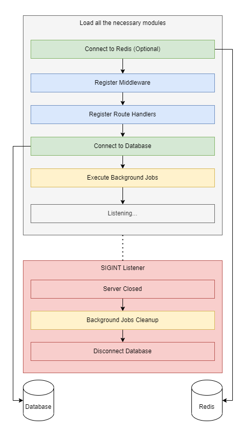
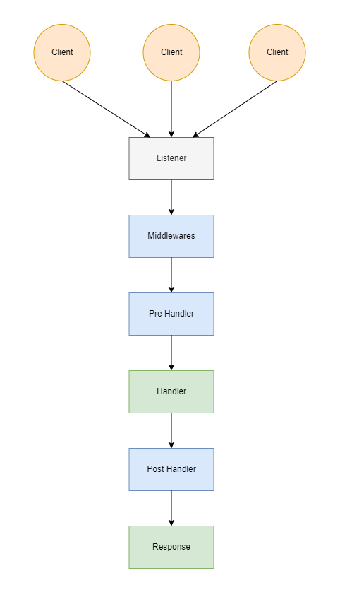

# Architecture

Understanding the inner mechanics of the development framework you engage with holds paramount significance. By delving into its core functionalities, you gain mastery over its tools and optimize your coding practices. This knowledge enables you to troubleshoot effectively, innovate confidently, and build solutions that harness the framework's full potential. In essence, unravelling the framework's intricacies empowers you to craft robust and efficient applications.

Epic API is a Deno framework built on top of the Oak framework, extending the power of the Oak framework while keeping simplicity and performance. You need to understand the internal workings of the Epic API framework so that you can master it.

The following diagram shows the lifecycle of an Epic API, loading and registering modules, connecting to the database, executing the jobs, and listening to the HTTP requests, etc.

<figure><figcaption>
Epic API Lifecycle
</figcaption></figure>

### Application startup sequence

1. **Module Loading**:\
   Load all necessary modules into memory, including middlewares, controllers, models, jobs, and hooks.
2. **Service Connection**:\
   Attempt to connect to critical services such as the database, caching store, queue system, translation, and any other internal services.
3. **Pre-Start Jobs**:\
   Execute any pre-start jobs required before initializing the Oak framework.
4. **Oak Server Preparation**:\
   Set up the Oak server by:
   * Registering static content on the root of the API.
   * Configuring middleware and routes from controllers on the `/api/` base URL.
   * Implementing pre and post-execution hooks for each request handler.
5. **Post-Start Jobs**:\
   Execute any necessary jobs after the Oak framework has been set up.
6. **SIGINT Listener Registration**:\
   Register a SIGINT listener to manage cleanup during a graceful shutdown.

Once an Epic API server spins up, it starts listening to the HTTP requests from the clients. See the following diagram to understand the request-response lifecycle:

<figure><figcaption>
Epic API's Request-Response Lifecycle
</figcaption></figure>

### Request Handling Sequence

1. **Client Sends the Request**\
   The process begins when a client sends a request to the server.
2. **Determine Content Type**
   * If the request is for static content, the server immediately serves the requested content.
   * If the request targets the `/api/` base URL, it requires further processing.
3. **Pre-handler Hooks Execution**\
   The request passes through pre-handler hooks for any preliminary processing required before reaching the endpoint.
4. **Request Handled by Endpoint**\
   The request is then processed by the appropriate endpoint based on the request URL and method.
5. **Post-handler Hooks Execution**\
   After the endpoint has processed the request, it moves through post-handler hooks for additional processing if needed.
6. **Response Sent Back to Client**\
   Finally, a response is generated and sent back to the client.

This sequence ensures that requests are processed efficiently, with appropriate handling steps for different types of content and additional custom
