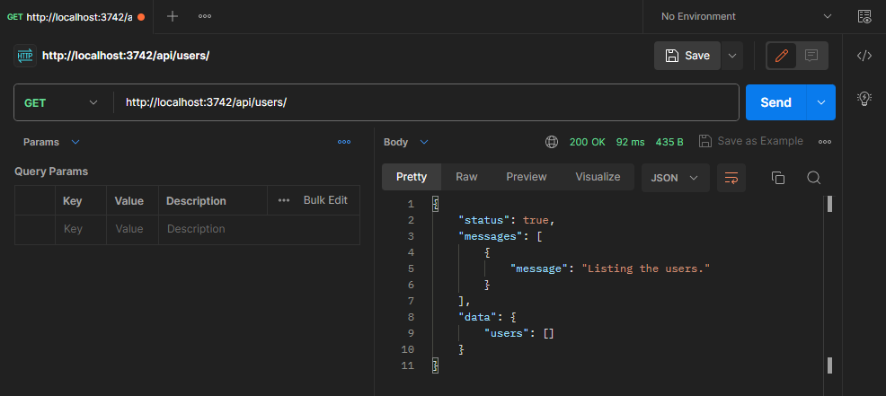

# Controllers

A controller's purpose is to receive specific requests for the application. The **routing** mechanism controls which controller receives which requests. Frequently, each controller has more than one route, and different routes can perform different actions.

To create a basic controller, we use classes and **decorators**. Decorators associate classes with required metadata and enable Epic API to create a routing map (tie requests to the corresponding controllers).

Here is what a basic controller looks like:


```typescript
import {
  Controller,
  BaseController,
  Get,
  Response,
  type IRoute,
  type IRequestContext,
} from "@Core/common/mod.ts";
import { type RouterContext } from "oak";

@Controller("/users/", { name: "users" })
export default class UsersController extends BaseController {
  @Get("/")
  public list(_: IRoute) {
    // This is a factory method that returns a request handler.
    // This scope is executed just once in the server's lifecycle.
    // Write any validation schemas or metalogic here.
    // Information returned from this function can be used to generate docs etc.
  
    return (ctx: IRequestContext<RouterContext<string>>) => {
      // This function handles all the requests received from the clients!
      // Write your request handler code here...

      return Response.status(true);
    };
  }
}

```


### Create Controller

Use the following command to create your first controller in the project:

```bash
# Execute the built-in Deno task
deno task create:module -t controller -n users --template validated.ts
```

***


**Pro Tip**

For creating a new module, you can also use `deno task create` as an alternative to `deno task create:module`. This can simplify the command while achieving the same result.


This command will create a new file in the `controllers/` directory and also adds `users.ts` in the `.sequence.json` file.

You may have noticed the flag `--template` , which is set to `validated.ts`. This flag tells the script to create a controller with a validation-included controller boilerplate in the `templates/controller.validated.ts` file, so you don't have to write the validation code from scratch!


**Note:** Epic API has a built-in validation library called `validator`. The API of this library is almost the same as [Zod](https://zod.dev/)! However, it is extended with some extra features to level up the power of Epic API. [See here](../techniques/validations.md).


This is what the generated controller looks like:


```typescript
import {
  Controller,
  BaseController,
  Get,
  Post,
  Response,
  type IRoute,
  type IRequestContext,
} from "@Core/common/mod.ts";
import { Status, type RouterContext } from "oak";
import e from "validator";

@Controller("/users/", { name: "users" })
export default class UsersController extends BaseController {
  @Post("/")
  public create(route: IRoute) {
    // Define Query Schema
    const QuerySchema = e.object({}, { allowUnexpectedProps: true });

    // Define Params Schema
    const ParamsSchema = e.object({});

    // Define Body Schema
    const BodySchema = e.object({});

    return {
      shape: () => ({
        query: QuerySchema.toSample(),
        params: ParamsSchema.toSample(),
        body: BodySchema.toSample(),
      }),
      handler: async (ctx: IRequestContext<RouterContext<string>>) => {
        // Query Validation
        const Query = await QuerySchema.validate(
          Object.fromEntries(ctx.router.request.url.searchParams),
          { name: `${route.scope}.query` }
        );

        /**
         * It is recommended to keep the following validators in place even if you don't want to validate any data.
         * It will prevent the client from injecting unexpected data into the request.
         *
         * */

        // Params Validation
        const Params = await ParamsSchema.validate(ctx.router.params, {
          name: `${route.scope}.params`,
        });

        // Body Validation
        const Body = await BodySchema.validate(
          await ctx.router.request.body.json(),
          { name: `${route.scope}.body` }
        );

        // Start coding here...

        return Response.statusCode(Status.Created);
      },
    };
  }

  @Get("/")
  public list(route: IRoute) {
    // Define Query Schema
    const QuerySchema = e.object({}, { allowUnexpectedProps: true });

    // Define Params Schema
    const ParamsSchema = e.object({});

    return {
      shape: () => ({
        query: QuerySchema.toSample(),
        params: ParamsSchema.toSample(),
      }),
      handler: async (ctx: IRequestContext<RouterContext<string>>) => {
        // Query Validation
        const Query = await QuerySchema.validate(
          Object.fromEntries(ctx.router.request.url.searchParams),
          { name: `${route.scope}.query` }
        );

        /**
         * It is recommended to keep the following validators in place even if you don't want to validate any data.
         * It will prevent the client from injecting unexpected data into the request.
         *
         * */

        // Params Validation
        const Params = await ParamsSchema.validate(ctx.router.params, {
          name: `${route.scope}.params`,
        });

        // Start coding here...

        return Response.status(true);
      },
    };
  }
}

```



**Tip for VS Code users!**

You type `req` or `reqf` and press enter in the VS Code to automatically generate the controller method!


Please don't get panic looking at this big code! You will understand everything in a bit... :smile:


The routes for this controller will be accessible on the following endpoint: `{{host}}/api/users/`



**Did you notice the postman property?**

This property is returned as the metadata of this controller's request. You may pass a sample data shape to this property so that the postman can document what information shape this route accepts! [See how it works](../utilities/postman.md).

Defining the data shapes during development is a headache! And this is where `validator` got you covered! The `validator` will generate the shape of information based on the schema you've defined. It will be better to review the upper example code for better understanding.


### Controller Components

See the following part of the code:

```typescript
import {
  Controller,
  BaseController,
  Get,
  Post,
  Response,
  type IRoute,
  type IRequestContext,
} from "@Core/common/mod.ts";
```

This code imports some components from `@Core/common/mod.ts`. These components are used to create a working controller. The following are some important components exported by `@Core/common/mod.ts` module:

<table><thead><tr><th width="205.33333333333331">Component</th><th width="172">Type</th><th>Description</th></tr></thead><tbody><tr><td>BaseController</td><td>Class</td><td>Every controller class is required to extend BaseController</td></tr><tr><td>Controller</td><td>Decorator</td><td>Use this decorator to define a controller</td></tr><tr><td>Get</td><td>Decorator</td><td>Used to define a <code>GET</code> route on a controller class method</td></tr><tr><td>Post</td><td>Decorator</td><td>Define a <code>POST</code> route</td></tr><tr><td>Patch</td><td>Decorator</td><td>Define a <code>PATCH</code> route</td></tr><tr><td>Put</td><td>Decorator</td><td>Define a <code>PUT</code> route</td></tr><tr><td>Delete</td><td>Decorator</td><td>Define a <code>DELETE</code> route</td></tr><tr><td>Options</td><td>Decorator</td><td>Define an <code>OPTIONS</code> route</td></tr><tr><td>Route</td><td>Decorator</td><td>Define a route with any above method.</td></tr><tr><td>Response</td><td>Class</td><td>Every route method returns an object that contains a route handler function, and this route handler function should return a Response class instance or a <code>void</code>.</td></tr></tbody></table>

### Create Controller Manually

In order to understand the workings of each component above, we need to create a component manually. We will create a controller step by step so that you can understand each and every component in detail.

#### Step 1:

Let's suppose we are working on a controller file called `controllers/users.ts`, start by writing the following code:


```typescript
import { BaseController, Controller } from "@Core/common/mod.ts";

@Controller("/users/", { name: "users" })
export default class UsersController extends BaseController {}
```


Ok, that looks cool! We've exported a default class called `UsersController` that extends `BaseController` a class. We also decorated the `UsersController` class with `Controller` decorator. Then we passed the "/users/" path as the first argument of `Controller` a decorator, and then an object containing `name` property (A unique name of this controller that can be used for multiple stuff E.g. permission name-spacing.) at the second argument.

Now, in order to import this controller into the project, we will insert the filename into the `.sequence.json` file in the same directory. The sequence file should look like the following:


```json
{
  "sequence": [
    "users.ts"
  ]
}
```


#### Step 2:

Now that we have a working controller. Let's continue adding a `GET` route to this controller. We will modify the above code as follows:


```typescript
import { BaseController, Controller, Get, Response } from "@Core/common/mod.ts";

@Controller("/users/", { name: "users" })
export default class UsersController extends BaseController {
  static UsersList: { username: string; password: string }[] = [];

  static getUsers = () => UsersController.UsersList;

  @Get("/")
  public list() {
    // Return a request handler function.
    return () => {
      // You will write your fetch users logic here.
      const Users = UsersController.getUsers();

      // Return a response instance.
      if (Users)
        return Response.message("Listing the users.").data({
          users: Users, // Users list here...
        });

      return Response.status(false).message("No users found!");
    };
  }
}

```


In this code, we have imported a `Get` decorator and a `Response` class from `@Core/common/mod.ts` a module. Then we created a service method `getUsers` for the `UsersController` class. And then, we created a `list` method decorated with the `Get` decorator on the `UsersController` a class that returns a request handler function. You will write your fetch users logic in this handler and return a `Response` instance accordingly.


You can either return a request handler function directly from the `list` method or you can also return an object that contains a property `handler` which will be the request handler function. This object will also allow you to pass extra information like you've seen `postman` property in the above examples.


Now spin up the server with the following command:

```bash
# Execute the built-in Deno task
deno task dev
```

Now if we test our endpoint in the Postman, we get the following result:

<figure><figcaption><p>GET http://localhost:3742/api/users/</p></figcaption></figure>

#### Step 3:

Let's extend our controller's functionality by adding a `POST` route. Again we will modify the above code like this:


```typescript
import {
  BaseController,
  Controller,
  Get,
  Post,
  Response,
  type IRoute,
  type IRequestContext,
} from "@Core/common/mod.ts";
import { Status, type RouterContext } from "oak";
import e from "validator";

@Controller("/users/", { name: "users" })
export default class UsersController extends BaseController {
  static UsersList: { username: string; password: string }[] = [];

  static getUsers = () => UsersController.UsersList;

  static createUser = (user: { username: string; password: string }) => {
    UsersController.UsersList.push(user);
  };

  @Get("/")
  public list(route: IRoute) {
    // Return a request handler function.
    return () => {
      // You will write your fetch users logic here.
      const Users = UsersController.getUsers();

      // Return a response instance.
      if (Users)
        return Response.message("Listing the users.").data({
          users: Users, // Users list here...
        });

      return Response.status(false).message("No users found!");
    };
  }

  @Post("/")
  public create(route: IRoute) {
    // Create a body validator schema.
    const BodySchema = e.object({
      username: e.string(),
      password: e.string(),
    });

    // Return a request handler function.
    return async (ctx: IRequestContext<RouterContext<string>>) => {
      // Validate user data
      const User = await BodySchema.validate(
        await ctx.router.request.body.json(),
        { name: `${route.scope}.body` }
      );

      // Create user
      UsersController.createUser(User);

      // Return a response instance.
      return Response.statusCode(Status.Created).data({
        user: User,
      });
    };
  }
}

```


Now if we test our endpoint in the Postman, we get the following result:

<figure><figcaption><p>POST http://localhost:3742/api/users/</p></figcaption></figure>

Let's try to execute the previous route again and we get the following result:

<figure><figcaption><p>GET http://localhost:3742/api/users/</p></figcaption></figure>

Congratulations! You have successfully created your first Epic API :tada:

Now you can use the following command to delete the controller:


**Warning!** You cannot undo the following command, which can lead to a code deletion! Be careful when using this command.


```bash
# Execute the built-in Deno task
deno task delete:module -t controller -n users.ts
```
