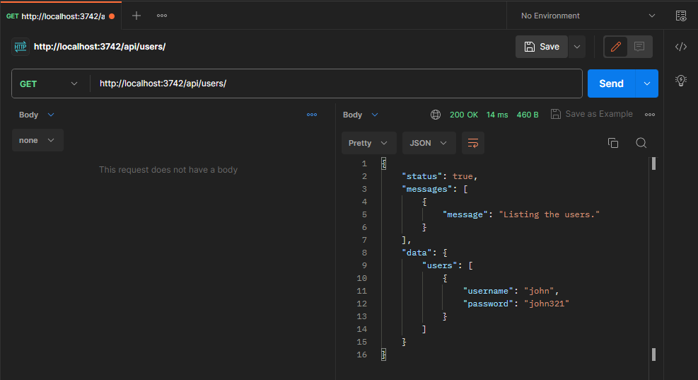

# Controllers

A controller's purpose is to receive specific requests for the application. The **routing** mechanism controls which controller receives which requests. Frequently, each controller has more than one route, and different routes can perform different actions.

In order to create a basic controller, we use classes and **decorators**. Decorators associate classes with required metadata and enable Epic API to create a routing map (tie requests to the corresponding controllers).

Here is how a basic controller looks like:


```typescript
import {
  Controller,
  BaseController,
  Get,
  Response,
  type IRequestContext,
} from "@Core/common/mod.ts";
import Manager from "@Core/common/manager.ts";
import { type RouterContext } from "oak";

@Controller("/users/", {
  name: "users",

  /** Do not edit this code */
  childs: () => Manager.getModules("controllers", import.meta.url),
  /** --------------------- */
})
export default class UsersController extends BaseController {
  @Get("/")
  public list() {
    // Write any validation schemas or meta logic here.
    // Information returned from this function can be used to generate docs etc.
  
    return {
      handler: async (ctx: IRequestContext<RouterContext<string>>) => {
        // This function actually handles the request!
        // Start coding here...

        return Response.status(true);
      },
    };
  }
}

```


### Create Controller

Use the following command to create your first controller in the project:

```bash
# Execute the built-in Deno task
deno task create:module -t controller -n users --template validated.ts
```

This command will create a new file in the `controllers/` directory and also adds `users.ts` in the `.sequence.json` file.

You may have notice the flag `--template` which is set to `validated.ts`. This flag tells the script to create a controller with validation boilerplate, so you don't have to write the validation code from scratch!


**Note:** Epic API has a built-in validation library called `validator`. The API of this library is almost the same as [zod](https://zod.dev/)! But it is extended with some extra features to level up the power of Epic API. [See here](../techniques/validations.md).


This is how the generated controller looks like:


```typescript
import {
  Controller,
  BaseController,
  Get,
  Post,
  Response,
  type IRequestContext,
} from "@Core/common/mod.ts";
import Manager from "@Core/common/manager.ts";
import { Status, type RouterContext } from "oak";
import e from "validator";

@Controller("/users/", {
  name: "users",

  /** Do not edit this code */
  childs: () => Manager.getModules("controllers", import.meta.url),
  /** --------------------- */
})
export default class UsersController extends BaseController {
  @Post("/")
  public create() {
    // Define Query Schema
    const QuerySchema = e.object({}, { allowUnexpectedProps: true });

    // Define Params Schema
    const ParamsSchema = e.object({});

    // Define Body Schema
    const BodySchema = e.object({});

    return {
      postman: {
        query: QuerySchema.toSample().data,
        params: ParamsSchema.toSample().data,
        body: BodySchema.toSample().data,
      },
      handler: async (ctx: IRequestContext<RouterContext<string>>) => {
        // Query Validation
        const Query = await QuerySchema.validate(
          Object.fromEntries(ctx.router.request.url.searchParams),
          { name: "users.query" }
        );

        /**
         * It is recommended to keep the following validators in place even if you don't want to validate any data.
         * It will prevent the client from injecting unexpected data into the request.
         *
         * */

        // Params Validation
        const Params = await ParamsSchema.validate(ctx.router.params, {
          name: "users.params",
        });

        // Body Validation
        const Body = await BodySchema.validate(
          await ctx.router.request.body({ type: "json" }).value,
          { name: "users.body" }
        );

        // Start coding here...

        return Response.statusCode(Status.Created);
      },
    };
  }

  @Get("/")
  public list() {
    // Define Query Schema
    const QuerySchema = e.object({}, { allowUnexpectedProps: true });

    // Define Params Schema
    const ParamsSchema = e.object({});

    return {
      postman: {
        query: QuerySchema.toSample().data,
        params: ParamsSchema.toSample().data,
      },
      handler: async (ctx: IRequestContext<RouterContext<string>>) => {
        // Query Validation
        const Query = await QuerySchema.validate(
          Object.fromEntries(ctx.router.request.url.searchParams),
          { name: "users.query" }
        );

        /**
         * It is recommended to keep the following validators in place even if you don't want to validate any data.
         * It will prevent the client from injecting unexpected data into the request.
         *
         * */

        // Params Validation
        const Params = await ParamsSchema.validate(ctx.router.params, {
          name: "users.params",
        });

        // Start coding here...

        return Response.status(true);
      },
    };
  }
}

```



The routes for this controller will be accessible on the following endpoint: `{{host}}/api/users/`



**Did you notice the postman property?**

This property is returned as the metadata of this controller's individual request. You may pass a sample data shape to this property so that postman can document what information shape this route accepts!

Defining the data shapes during the development is really a headache! And this is where `validator` got you covered! `validator` will generate the shape of information based on the schema you've defined. It will be better to review the upper example code for better understanding.


### Create a Child-Controller

A child-controller exposes routes under a parent-controller. For example: A user may have a post associated with it, in order to handle this scenario we create a child-controller.

Use the following command to create a child-controller `posts` under the parent-controller `users`:

```bash
# Execute the built-in Deno task
deno task create:module -t controller -n posts --template validated.ts --parent users.ts
```

This command will generate a similar controller as above, but it will be named as `controllers/users.posts.ts` (child-controller) instead of `controllers/posts.ts` that is considered as a parent-controller instead of a child-controller and will be invalid in the current scenario.

This is how your folder structure and `.sequence.json` file is going to look like:

<figure><figcaption><p>This is how your .sequence.json file will look like.</p></figcaption></figure>


The routes for this child-controller will be accessible on the following endpoint: `{{host}}/api/users/posts/`


Now that we have a basic knowledge on how to create controllers and how they are structured in Epic API, it is time to delve into the specifics. You may have noticed certain components in the above controllers, some of which you may be familiar with while others may be new to you. Let us now explore the constituent elements of controllers that enable their functionality.

### Controller Components

See the following part of the code:

```typescript
import {
  Controller,
  BaseController,
  Get,
  Post,
  Response,
  type IRequestContext,
} from "@Core/common/mod.ts";
```

This code imports some components from `@Core/common/mod.ts`. These components are used to create a working controller. Followings are some important components exported by `@Core/common/mod.ts` module:

| Component      | Type      | Description                                                                                                                                                       |
| -------------- | --------- | ----------------------------------------------------------------------------------------------------------------------------------------------------------------- |
| BaseController | Class     | Every controller class is required to extend BaseController                                                                                                       |
| Controller     | Decorator | Use this decorator to define a controller                                                                                                                         |
| Get            | Decorator | Used to define a `GET` route on a controller class method                                                                                                         |
| Post           | Decorator | Define a `POST` route                                                                                                                                             |
| Patch          | Decorator | Define a `PATCH` route                                                                                                                                            |
| Put            | Decorator | Define a `PUT` route                                                                                                                                              |
| Delete         | Decorator | Define a `DELETE` route                                                                                                                                           |
| Options        | Decorator | Define an `OPTIONS` route                                                                                                                                         |
| Route          | Decorator | Define a route with any above method.                                                                                                                             |
| Response       | Class     | Every route method returns an object that contains a route handler function, and this route handler function should return a Response class instance or a `void`. |


